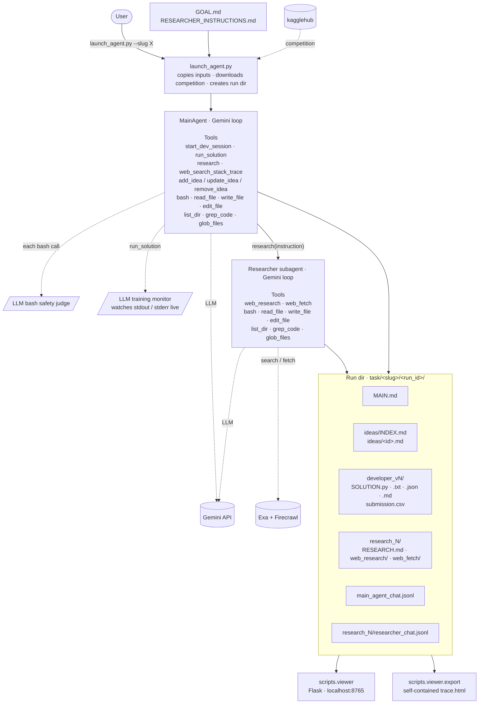

# Qgentic-AI

Qgentic-AI is an automated ML engineering stack. LLM-driven agents take a problem description, produce a technical plan, generate code, run it locally, analyse the results, and keep refining the solution. Targeted at Kaggle-style competitions today; the stack is extensible to non-competition goals.

▶ **[See an example run](https://htmlpreview.github.io/?https://gist.githubusercontent.com/bogoconic1/93fea3777d9baf5a9d67626223a83db6/raw/trace.html)** — full transcript of MainAgent + Researcher iterating on a competition, exported as a single self-contained HTML file.

## Results

[Kaggle Writeup](https://www.kaggle.com/competitions/deep-past-initiative-machine-translation/writeups/25th-post-training-qwen2-5-32b-and-72b-with-gemi)

| Kaggle Competition | LB Score | Ranking |
| --- | --- | --- |
| deep-past-initiative-machine-translation | **38.6113** | **Silver Medal Top 1% (24/2673)** |
| csiro-biomass | **0.63772** | **Silver Medal Top 1% (32/3802)** |

---

## Getting Started

### 1. Prerequisites

- Python 3.12
- CUDA-enabled GPU

```
conda create --name qgentic-ai python=3.12 -y
conda activate qgentic-ai

git clone https://github.com/bogoconic1/Qgentic-AI.git
cd Qgentic-AI
pip install uv
uv pip install -r requirements.txt
```

### 2. Configure API Keys

Create a `.env` file in the project root:

```
GOOGLE_API_KEY=...
OPENAI_API_KEY=...
ANTHROPIC_API_KEY=...
FIRECRAWL_API_KEY=...
HF_TOKEN=...
GOOGLE_CLOUD_PROJECT=...
GOOGLE_CLOUD_LOCATION=global
GOOGLE_GENAI_USE_VERTEXAI=True
KAGGLE_USERNAME=
KAGGLE_KEY=
```

### 3. Download Meta Kaggle

```
sudo apt-get install unzip
curl -L -o /workspace/meta-kaggle.zip https://www.kaggle.com/api/v1/datasets/download/kaggle/meta-kaggle
unzip meta-kaggle.zip -d /workspace/meta-kaggle
```

Then run:
```
python create_metadata.py --competition-slug "enter slug"
```

---

### Create Required Files

The repo ships two empty templates — `GOAL.example.md`, `RESEARCHER_INSTRUCTIONS.example.md`. Copy each one to the matching `*.md` filename and fill it in for your task; the `*.md` working copies are gitignored so per-task content never lands in the repo:

```bash
cp GOAL.example.md GOAL.md
cp RESEARCHER_INSTRUCTIONS.example.md RESEARCHER_INSTRUCTIONS.md
```

Then edit each `*.md` at the repo root:

- **`GOAL.md`**: Session-wide objective, threaded into every agent's system prompt.
- **`RESEARCHER_INSTRUCTIONS.md`**: Task-specific guidance inlined into the Researcher subagent's system prompt.

The Main Agent bootstraps everything else — it writes ideas, research reports, and per-iteration developer outputs under `task/<slug>/<run_id>/` itself.

### Launch

```bash
python launch_agent.py --slug "enter slug"
python launch_agent.py --slug "enter slug" --run-id my_run --goal-file path/to/GOAL.md
```

`--slug` triggers a `kagglehub` download into `task/<slug>/`. Run id defaults to a timestamp. Main Agent runs indefinitely until the goal is met — SIGINT/SIGKILL when satisfied.

### Architecture



### Monitoring

- `task/<slug>/<run_id>/main_agent_chat.jsonl` — append-only audit log of every MainAgent step (assistant turn + tool result).
- `task/<slug>/<run_id>/developer_v{N}/` — per-attempt artifacts MainAgent writes via `start_dev_session` (`SOLUTION.py`, `SOLUTION.txt`, `SOLUTION.json`, `submission.csv`, …).
- `task/<slug>/<run_id>/research_<N>/` — per-call researcher artifacts (`RESEARCH.md` + `web_research/`/`web_fetch/` audit records) plus `researcher_chat.jsonl`.
- `task/<slug>/<run_id>/ideas/` — idea pool (memdir-style `INDEX.md` + one file per idea).
- Weights & Biases / Weave tracking is configured via `config.yaml` under `tracking.wandb`.

#### Web viewer

A local Flask app reads the three `*_chat.jsonl` files and renders the full transcript with collapsible tool calls/results, links to companion artifacts (`MAIN.md`, `SOLUTION.{py,md,json,txt}`, `RESEARCH.md`, `web_research/`, `web_fetch/`), and a `?live=1` mode that meta-refreshes every 3 s.

```bash
python -m scripts.viewer --port 8765
# → http://127.0.0.1:8765/
```

Defaults to `127.0.0.1` only — never binds publicly. To reach a remote VM, SSH local-forward the port (`ssh -L 8765:127.0.0.1:8765 …`) rather than passing `--host 0.0.0.0`. Bash tool calls render as `$ <command>` in a shell-style block instead of escaped JSON.

##### Sharing a run as a gist

Export one run as a self-contained HTML file (inline CSS, MainAgent + every Researcher subagent inlined as collapsible sections, no broken links), then upload it as a secret gist and view it through the htmlpreview proxy.

[**Example trace**](https://htmlpreview.github.io/?https://gist.githubusercontent.com/bogoconic1/93fea3777d9baf5a9d67626223a83db6/raw/trace.html) — what one exported run looks like.

```bash
python -m scripts.viewer.export <slug> <run_id> -o trace.html
gh gist create trace.html                                  # secret gist; URL-only access. Add --public to list it on your profile.
GIST_ID=<id-from-the-printed-URL>
GH_USER=$(gh api user --jq .login)
echo "https://htmlpreview.github.io/?https://gist.githubusercontent.com/$GH_USER/$GIST_ID/raw/trace.html"
```

That URL omits the per-revision commit hash, so it always points to the **latest** revision of the gist. Refresh during a live run with `python -m scripts.viewer.export … -o trace.html && gh gist edit $GIST_ID trace.html` — the preview link stays the same; viewers just hit reload. (Want a frozen snapshot instead? Use the hashed `gh api gists/$GIST_ID --jq '.files["trace.html"].raw_url'` form.)

---

## License

MIT
